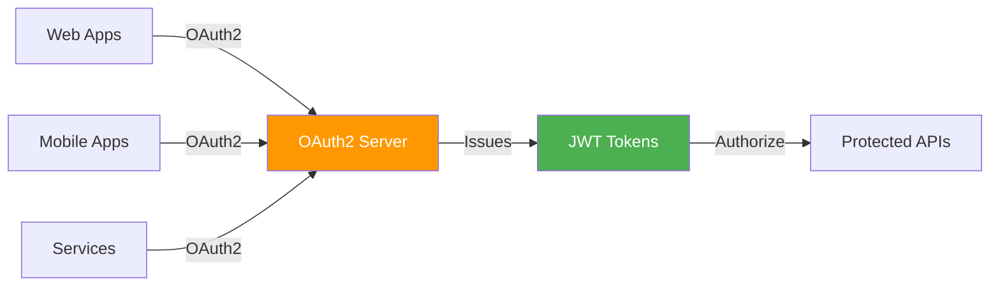
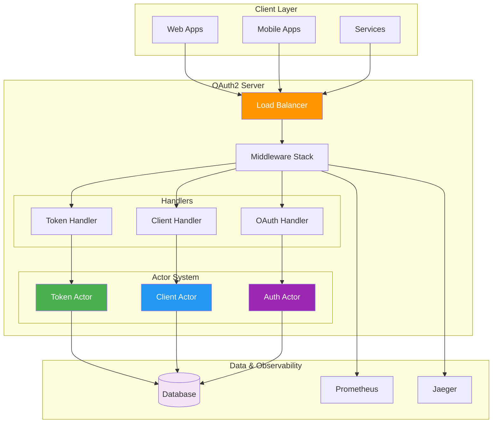

# Rust OAuth2 Server

[](https://github.com/ianlintner/rust_oauth2_server/actions/workflows/ci.yml)


A complete, production-ready OAuth2 authorization server built with Rust and Actix-web, featuring the actor model for concurrency, type safety, and comprehensive observability.



## Features

- **OAuth2 Flows** — Authorization Code (with PKCE), Client Credentials, Resource Owner Password, Refresh Token with rotation
- **Standards** — Token Introspection (RFC 7662), Token Revocation (RFC 7009), Discovery (RFC 8414), OpenID Connect
- **Actor Model** — Actix actors for concurrent, fault-tolerant request handling
- **Database** — SQLite or PostgreSQL via SQLx with Flyway migrations
- **Social Login** — Google, Microsoft, GitHub, Azure AD (Okta & Auth0 planned)
- **Admin Dashboard** — Web-based client, token, and user management
- **Observability** — Prometheus metrics, OpenTelemetry tracing, structured logging, health checks
- **API Docs** — OpenAPI 3.0 with Swagger UI
- **Deployment** — Docker multi-stage builds, Kubernetes manifests with Kustomize, CI/CD via GitHub Actions
- **MCP Server** — Model Context Protocol server for AI-assisted management

## Security

- PKCE required for authorization code flow (S256 only)
- JWT secret enforcement (>= 32 chars, rejects insecure defaults at startup)
- Startup validation aborts on insecure JWT secrets or default seed passwords
- HTTP security headers (CSP, X-Frame-Options, X-Content-Type-Options, Referrer-Policy)
- CORS fail-closed by default (denies all cross-origin unless explicitly configured)
- Open redirect prevention on `return_to` parameters
- Admin authentication (`AdminGuard` middleware on all `/admin/*` routes)
- Scope-based authorization and token revocation
- Argon2 password hashing, secure session cookies with fixation prevention

## Modular Crates

This repository is a Cargo workspace. You can reuse the OAuth2 domain types and integrate your own DAO without forking.

| Crate | Purpose |
| --- | --- |
| `oauth2-core` | Framework-agnostic domain types (`Client`, `Token`, `AuthorizationCode`, `OAuth2Error`) |
| `oauth2-ports` | Integration traits (`Storage`) that your DAO implements |
| `oauth2-config` | Configuration loading and validation |
| `oauth2-storage-sqlx` | Reference SQLx adapter (SQLite/Postgres) |
| `oauth2-storage-factory` | Backend selection + `ObservedStorage` wrapper |
| `oauth2-actix` | Actix-web HTTP handlers + actors |
| `oauth2-observability` | Tracing, metrics, OpenTelemetry helpers |
| `oauth2-events` | Auth event types + pluggable backends (in-memory, console, Redis, Kafka, RabbitMQ) |
| `oauth2-social-login` | Social login provider integrations |
| `oauth2-server` | Runnable server assembly |

## Quick Start

```bash
# Clone
git clone https://github.com/ianlintner/rust_oauth2_server.git
cd rust_oauth2_server

# Migrate
./scripts/migrate.sh

# Run (dev)
cargo run

# Run (production)
cargo run --release
```

### Docker

```bash
# Docker Compose
docker-compose up -d

# Or use the prebuilt image — see docs/deployment/dockerhub.md
```

### Kubernetes

```bash
kubectl apply -k k8s/overlays/dev        # Development
kubectl apply -k k8s/overlays/staging     # Staging
kubectl apply -k k8s/overlays/production  # Production
```

See the [Kubernetes Deployment Guide](k8s/README.md) for details.

## Configuration

The server loads configuration from a HOCON file (`application.conf`), environment variables (`OAUTH2_*` prefix), and built-in defaults — in that priority order.

```bash
cp application.conf.example application.conf

# Or configure via environment variables:
export OAUTH2_SERVER_HOST=127.0.0.1
export OAUTH2_SERVER_PORT=8080
export OAUTH2_DATABASE_URL=sqlite:oauth2.db?mode=rwc
export OAUTH2_JWT_SECRET=$(openssl rand -base64 48)
```

See the [Configuration Guide](docs/getting-started/configuration.md) for all environment variables, social login setup, event system configuration, and ID token signing.

## Endpoints

### User Interface

| Endpoint | Description |
| --- | --- |
| `GET /` | Redirects to profile page |
| `GET /auth/login` | Login page with social login options |
| `GET /auth/profile` | User profile page |
| `POST /auth/logout` | Logout |

### OAuth2

| Endpoint | Description |
| --- | --- |
| `GET /oauth/authorize` | Authorization endpoint |
| `POST /oauth/token` | Token endpoint |
| `POST /oauth/introspect` | Token introspection (RFC 7662) |
| `POST /oauth/revoke` | Token revocation (RFC 7009) |
| `GET /oauth/userinfo` | OpenID Connect UserInfo |

### Discovery & OIDC

| Endpoint | Description |
| --- | --- |
| `GET /.well-known/openid-configuration` | Server metadata (RFC 8414) |
| `GET /.well-known/jwks.json` | JSON Web Key Set |

### Social Login

| Endpoint | Description |
| --- | --- |
| `GET /auth/login/{provider}` | Initiate social login (google, microsoft, github, azure, okta, auth0) |
| `GET /auth/callback/{provider}` | OAuth callback handler |

### Admin

| Endpoint | Description |
| --- | --- |
| `GET /admin` | Admin dashboard |
| `GET /admin/api/dashboard` | Dashboard summary data |
| `GET /admin/api/clients` | List clients |
| `POST /admin/clients/register` | Register a new client |
| `DELETE /admin/api/clients/{id}` | Delete a client |
| `GET /admin/api/tokens` | List tokens |
| `POST /admin/api/tokens/{id}/revoke` | Revoke a token |
| `GET /admin/api/users` | List users |

### Monitoring

| Endpoint | Description |
| --- | --- |
| `GET /health` | Health check |
| `GET /ready` | Readiness check |
| `GET /metrics` | Prometheus metrics |
| `GET /swagger-ui` | Interactive API docs |

### Events

| Endpoint | Description |
| --- | --- |
| `POST /events/ingest` | Event ingestion endpoint |
| `GET /events/health` | Event system health |

## Architecture



For detailed architecture documentation, see the [Architecture Overview](docs/architecture/overview.md).

## Documentation

Full documentation is available in the [`docs/`](docs/) directory:

- **[Getting Started](docs/getting-started/installation.md)** — Installation, quick start, configuration
- **[OAuth2 Flows](docs/flows/authorization-code.md)** — Authorization code, client credentials, refresh token, password grant
- **[API Reference](docs/api/endpoints.md)** — Endpoints, authentication, error handling
- **[Architecture](docs/architecture/overview.md)** — System design, actor model, database schema
- **[Admin Panel](docs/admin/dashboard.md)** — Dashboard, client and token management
- **[Deployment](docs/deployment/docker.md)** — Docker, Kubernetes, production hardening
- **[Observability](docs/observability/metrics.md)** — Metrics, tracing, logging, health checks
- **[Development](docs/development/contributing.md)** — Contributing, testing, CI/CD
- **[MCP Server](mcp-server/README.md)** — AI integration with Model Context Protocol

## Contributing

Contributions are welcome! See the [Contributing Guide](docs/development/contributing.md) for development guidelines.

## License

Dual-licensed under MIT OR Apache-2.0, at your option.

## Resources

- [OAuth 2.0 RFC 6749](https://tools.ietf.org/html/rfc6749)
- [PKCE RFC 7636](https://tools.ietf.org/html/rfc7636)
- [Token Introspection RFC 7662](https://tools.ietf.org/html/rfc7662)
- [Token Revocation RFC 7009](https://tools.ietf.org/html/rfc7009)
- [Actix Web Documentation](https://actix.rs/)
