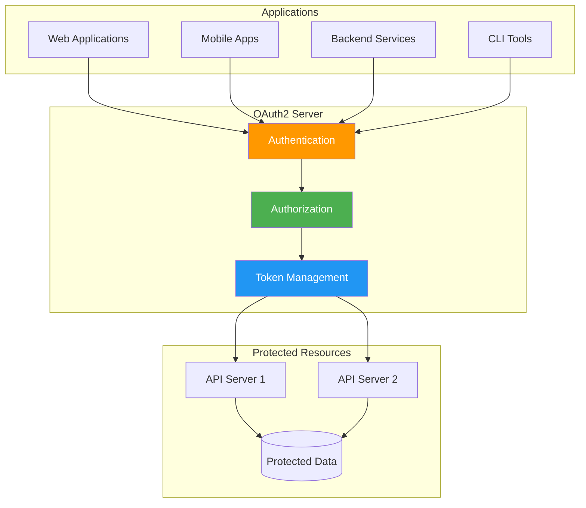
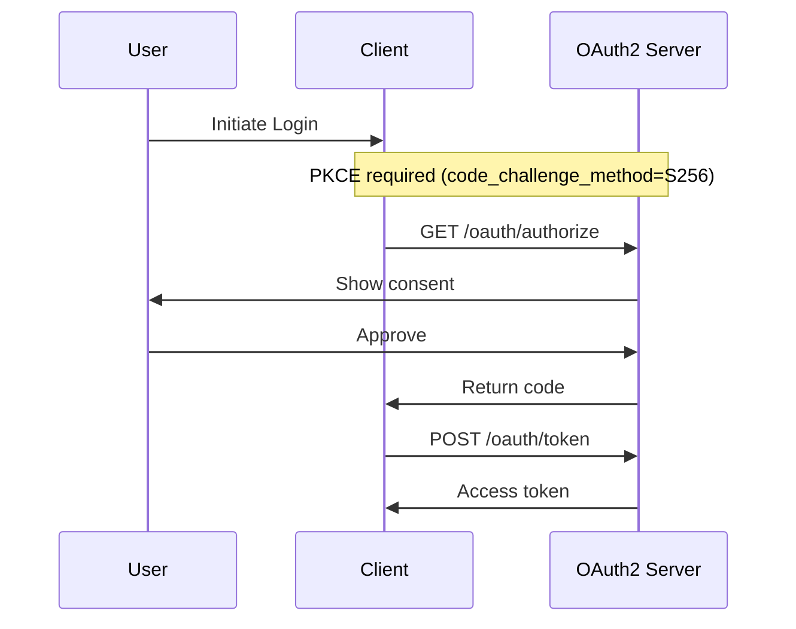
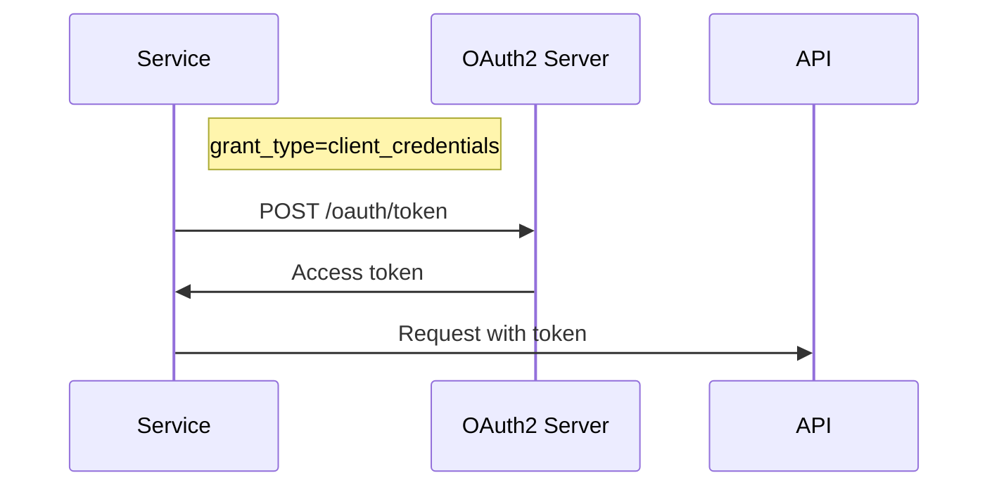

# Rust OAuth2 Server

Welcome to the documentation for the Rust OAuth2 Server — a production-ready, high-performance OAuth2 authorization server built with Rust and Actix-web.



## Highlights

- **OAuth2 + OIDC** — Authorization Code (PKCE), Client Credentials, Refresh Token, Password Grant, Discovery, UserInfo, JWKS
- **Secure by default** — JWT secret enforcement, startup validation, HTTP security headers, CORS fail-closed, open redirect prevention
- **Actor model** — Concurrent, fault-tolerant request handling via Actix actors
- **Observable** — Prometheus metrics, OpenTelemetry tracing, structured logging, health checks
- **Cloud-native** — Docker, Kubernetes, stateless design, horizontal scaling

## OAuth2 Flows

### Authorization Code Flow (with PKCE)

The most secure flow for web and mobile applications:



**When to use:** Web applications, mobile apps, SPAs

[Learn more →](flows/authorization-code.md)

### Client Credentials Flow

For service-to-service authentication:



**When to use:** Microservices, backend services, APIs

[Learn more →](flows/client-credentials.md)

### Refresh Token Flow

!!! warning "Disabled by Default"
The `refresh_token` grant is disabled by default (OAuth 2.0 Security BCP). Requests will be rejected with `unsupported_grant_type`.

[Learn more →](flows/refresh-token.md)

### Password Grant Flow

!!! warning "Disabled by Default"
The Resource Owner Password Credentials (ROPC) grant is disabled by default.

[Learn more →](flows/password.md)

## Quick Start

```bash
git clone https://github.com/ianlintner/rust_oauth2_server.git
cd rust_oauth2_server
./scripts/migrate.sh
cargo run
```

Register a client and get a token:

```bash
# Register (requires admin session)
curl -X POST http://localhost:8080/admin/clients/register \
  -H "Content-Type: application/json" \
  -b "session_cookie=YOUR_ADMIN_SESSION" \
  -d '{"client_name":"My App","redirect_uris":["http://localhost:3000/callback"],"grant_types":["authorization_code"],"scope":"read write"}'

# Get token (client credentials)
curl -X POST http://localhost:8080/oauth/token \
  -d "grant_type=client_credentials&client_id=YOUR_CLIENT_ID&client_secret=YOUR_CLIENT_SECRET"
```

## Next Steps

1. **[Install the server](getting-started/installation.md)** — Prerequisites and setup
2. **[Quick start guide](getting-started/quickstart.md)** — Complete your first OAuth2 flow
3. **[Configuration](getting-started/configuration.md)** — Environment variables, social login, OIDC
4. **[API reference](api/endpoints.md)** — All endpoints and error codes
5. **[Deploy to production](deployment/production.md)** — Docker, Kubernetes, security hardening
